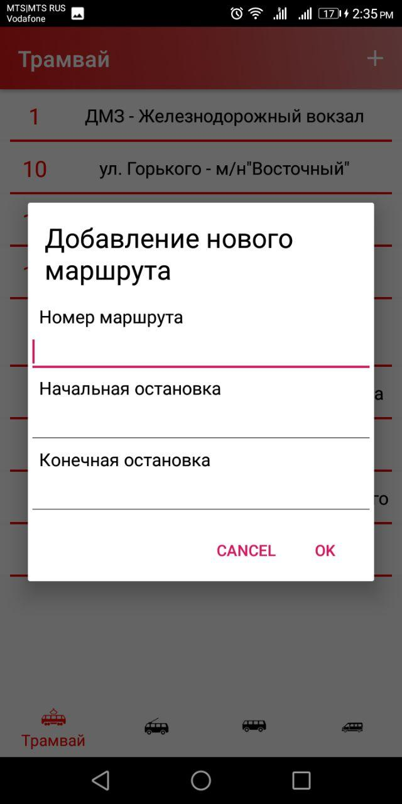

# NeverLate
TransTime project reborn. New programming language, new UI, new functions

Перерождение проекта TransTime с новым интерфейсом и новыми функциями

Ключевое изменение - теперь пользователи сами могут управлять базой данных, внося новые маршруты, остановки, время и корректируя существующие.

## Скачать beta версию
19.03.2020 - [Neverlate_beta_v1.1](./app/release/NeverLate_beta_v1.1.apk) - теперь можно установить напоминание о том, что пора выходить на остановку. За несколько минут (от 0 до 60) до прибытия транспорта на остановку приложение пришлёт уведомление. Можно устанавливать как одноразовые оведомления, так и ежедневные. На данный момент уведомления сбрасываются при перезагрузке устройства. Будет исправлено в следующей версии.

[NeverLate_beta_v1.0](./app/release/NeverLate_beta_v1.0.apk)

## Скриншоты

